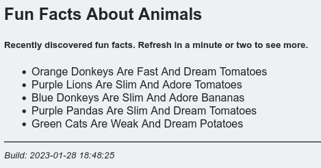

# Apache Kafka Sample Consumer (Observer)

## Description

Subcribes for events on a **topic** to a **broker**. Both, the topic and broker, can be managed via environment variables

In addition, provides a web interface to display the most recently read events

## Available variables

| Variable  | Description                                 | Default value  |
| --------- | ------------------------------------------- | -------------- |
| BROKER    | Broker to connect to (NAME:PORT)            | localhost:9092 |
| TOPIC     | Topic  to subscribe for (topic)             | demo           |
| APPPORT   | Sets the web interface (PORT)               | 5000           |

## Usage

```bash
# Syntax
docker container run [-d|-it] [--name fancyname] [--net appnet] [-e VAR1=VALUE1 -e ...] shekeriev/kafka-observer 

# Example
docker container run -d --name observer --net kafkanet -p 8080:80 -e BROKER=kafka:9092 -e TOPIC=animal-facts -e APPPORT=80 shekeriev/kafka-observer
```

## Sample output

Here is a sample output that can be seen on the console:

```text
 * Serving Flask app 'app'
 * Debug mode: off
WARNING: This is a development server. Do not use it in a production deployment. Use a production WSGI server instead.
 * Running on all addresses (0.0.0.0)
 * Running on http://127.0.0.1:80
 * Running on http://172.23.0.5:80
Press CTRL+C to quit
* trying to connect ...
* ... connected.
* trying to subscribe ...
* ... subscribed.
* end is 2
* will get last 2
* received an event
Orange Donkeys Are Fast And Dream Tomatoes
* received an event
Purple Lions Are Slim And Adore Tomatoes
* done
172.23.0.1 - - [28/Jan/2023 18:45:10] "GET / HTTP/1.1" 200 -
```

And here is what should appear in the web interface:




## Source code

The latest version of the source code can be obtained from here: <https://github.com/shekeriev/do2-app-pack/tree/main/kafka-observer>
