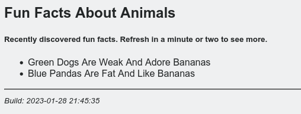

# RabbitMQ Sample Consumer (Observer)

## Description

Binds to a topic exchange and listens for messages based on a topic

## Available variables

| Variable   | Description                                 | Default value  |
| ---------- | ------------------------------------------- | -------------- |
| BROKER     | Broker to connect to (name)                 | localhost      |
| BROKERPORT | Broker's port to use (5672)                 | 5672           |
| EXCHANGE   | Exchange to bind to (topic)                 | demo           |
| TOPICS     | Topics to subscribe for (color.animal)      | #              |
| APPPORT    | Where to expose the web interface (5000)    | 5000           |

## Usage

```bash
# Syntax
docker container run [-d|-it] [--name fancyname] [--net appnet] [-e VAR1=VALUE1 -e ...] shekeriev/rabbit-cons 

# Example
docker container run -d --name observer --net appnet -p 8080:80 -e BROKER=rabbitmq -e BROKERPORT=5672 -e EXCHANGE=demo -e TOPICS='black.*' -e APPPORT=80 shekeriev/rabbit-observer
```

## Sample output

Here is a sample output that can be seen on the console:

```text
 * Serving Flask app 'app'
 * Debug mode: off
WARNING: This is a development server. Do not use it in a production deployment. Use a production WSGI server instead.
 * Running on all addresses (0.0.0.0)
 * Running on http://127.0.0.1:80
 * Running on http://172.23.0.4:80
Press CTRL+C to quit
 [x] (R) Subscribed for # on rabbitmq:5672. Listening ...
172.23.0.1 - - [28/Jan/2023 21:43:23] "GET / HTTP/1.1" 200 -
172.23.0.1 - - [28/Jan/2023 21:43:49] "GET / HTTP/1.1" 200 -
 [x] (R) 2023-01-28 21:44:01 / 'green.dogs': b'Green Dogs Are Weak And Adore Bananas'
172.23.0.1 - - [28/Jan/2023 21:44:01] "GET / HTTP/1.1" 200 -
172.23.0.1 - - [28/Jan/2023 21:44:10] "GET / HTTP/1.1" 200 -
 [x] (R) 2023-01-28 21:44:46 / 'blue.pandas': b'Blue Pandas Are Fat And Like Bananas'
```

And here is what should appear in the web interface:



## Source code

The latest version of the source code can be obtained from here: <https://github.com/shekeriev/do2-app-pack/tree/main/rabbit-observer>
